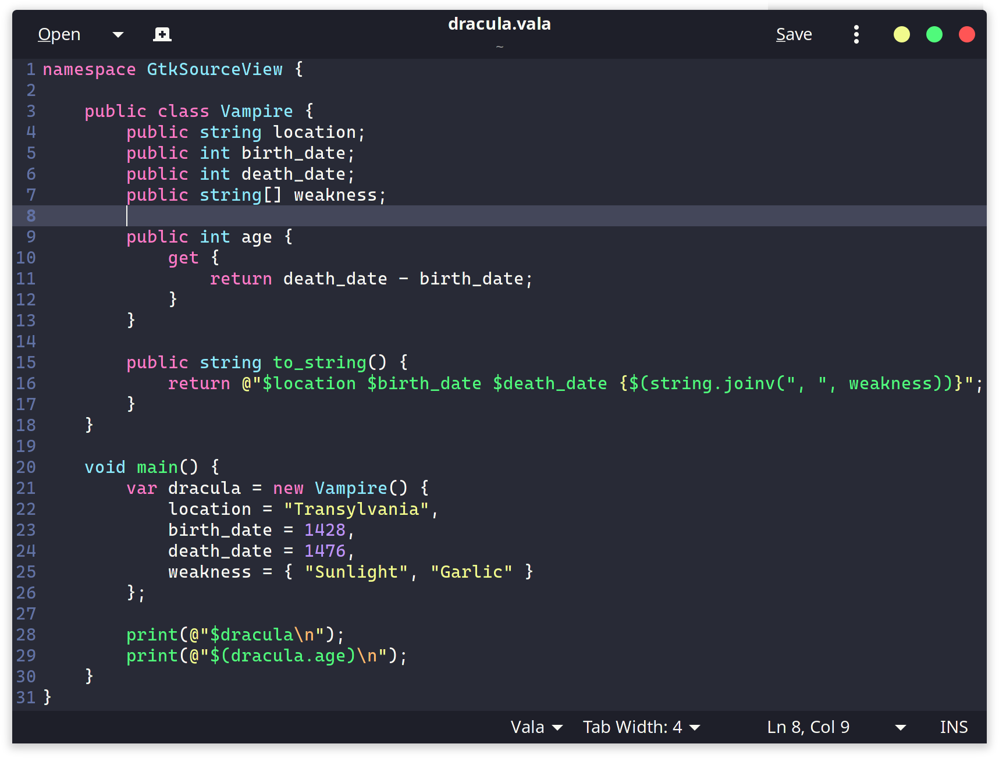

# Dracula for [GtkSourceView](https://wiki.gnome.org/Projects/GtkSourceView)

> A dark theme for [GtkSourceView](https://wiki.gnome.org/Projects/GtkSourceView).

## Install

All instructions can be found at [INSTALL.md](./INSTALL.md).

## Team

This theme is maintained by the following person(s) and a bunch of [awesome contributors](https://github.com/SpikedPaladin/dracula-gtksourceview/graphs/contributors).

 |
--- |
[PaladinDev](https://github.com/SpikedPaladin) |

## License

[MIT License](./LICENSE)